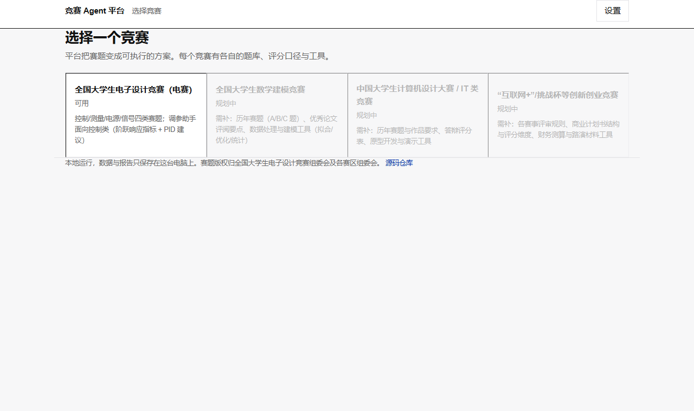
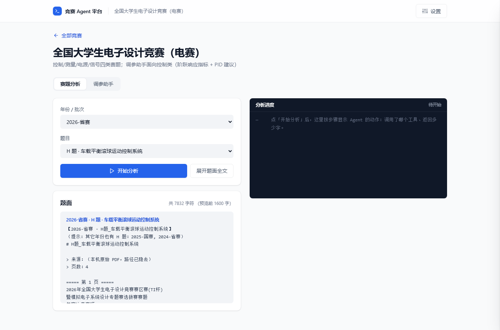
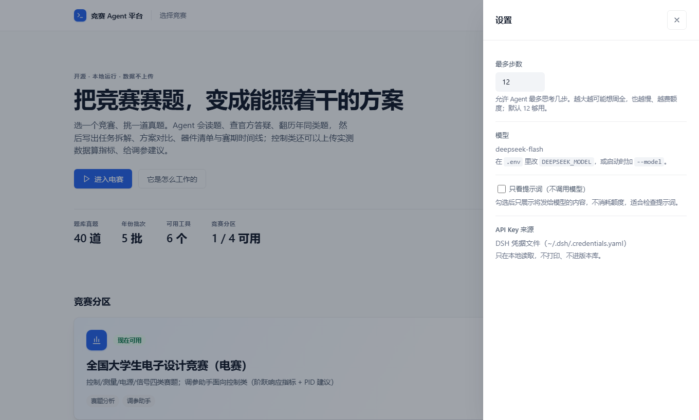

# 大学生竞赛工作台（contest-workbench）

> **曾用名 `diansai-agent`（电赛 Agent）**。2026-09 起改名：项目已从"电赛专用"长成**多竞赛平台**，
> 再叫电赛 Agent 就把身份锁死在单个竞赛上了。**旧链接由 GitHub 自动跳转**；旧环境变量 `DIANSAI_*` 仍兼容。

> 把一道**全国大学生电子设计竞赛（电赛）赛题**，变成一份**参赛队第二天早上就能照着干的方案**；
> 控制类还可以把实测数据算成超调量、上升时间、调节时间等指标，并给出 PID 调整建议。

[](LICENSE)
[](https://github.com/lk2168/contest-workbench/actions/workflows/tests.yml)
[](https://github.com/lk2168/contest-workbench/releases/latest)


**给谁用**：参加电赛的在校学生，尤其是不熟悉 AI 工具的人。有网页界面、**队友零安装**就能用；
Agent 每一步在做什么都显示出来；关键指标由本地算法计算、可以自己复核。

> ### ⬇️ [下载 Windows 版（免装 Python，双击即用）](https://github.com/lk2168/contest-workbench/releases/latest)
> 双击 → 浏览器自动打开 → 设置里填自己的 DeepSeek API Key → 选题目 → 开始分析。
> 首次启动要解包，约 5–10 秒属正常；不含题库（版权原因），详见[发行说明](https://github.com/lk2168/contest-workbench/releases/latest)。



<sub>上图：首页选一个竞赛。完整界面（工作台 / 设置 / 窄屏）见下方「网页端」一节。</sub>

---

## 它是什么 / 不是什么

| ✅ 它做 | ❌ 它不做 |
|---|---|
| 读赛题 → 逐条拆解要求并**量化** | 替你焊电路、写最终固件（它给骨架与参数初值） |
| 查**官方答疑**与**历年同类题**（跨年检索） | 编造指标或器件参数（提示词里明令禁止，缺数据就标"待确认"） |
| **调参助手**：串口/CSV 数据 → 超调量/上升时间/调节时间/稳态误差 + 曲线图 + PID 调整建议 | 替你决定最终参数（它给"改哪个、改多少、怎么验证"，实测还得你来） |

> **只想要串口工具？** 串口部分可以单独安装使用（命令行 + 独立说明）：见 [`README-serial.md`](README-serial.md)，装法 `pip install .`（核心只依赖 pyserial）。
| 出：任务拆解表 / 评分点推断 / 方案对比 / 器件清单 / 算法与 PID 初值 / 4天3夜时间线 / 风险预案 / 调参报告 | 猜官方评分细则（官方不公开，它只做**基于历年规律的推断**，并标注"需以官方细则为准"） |
| 报告自动落盘为 Markdown **+ Word** | 联网替你去比赛（赛期禁止与队外交流，方案里也不会出现这类建议） |

**实测样例**：用 2026 赛区赛 **H 题《车载平衡滚球运动控制系统》** 跑完整流程，结果是：自主 8 步、24 次工具调用（其中答疑检索 20 次）、产出 18.8 KB 报告 + Word；报告里给出逐条分值（6/16/13/20/20/20/5/20）、从赛道几何**推算出整圈 6.14 m** 与所需速度、3 个方案对比（舵机直推 / 步进丝杆 / 双闭环），并抓到答疑里的硬约束（循迹**只能用红外光电模块**、摆杆 25 cm PPR 管、**球位必须用摄像头**）。

---

## 两种用法

**方式一：直接下载 exe（给不想碰命令行的同学）**

到 [**Releases**](https://github.com/lk2168/contest-workbench/releases/latest) 下载 `contest-workbench.exe`，双击即可。
它会打开**自己的桌面窗口**（不是浏览器；用的是 Windows 自带的 WebView2，界面代码一行没改），
**不需要装 Python**；第一次用点右上角「设置」把 DeepSeek API Key 填进去（存在用户目录，不上传）。
想用浏览器打开：`contest-workbench.exe --browser`；只起服务（局域网共享）：`--server-only`。
Exe 同目录下放 `data/题库/<分区>/` 就能读到自己的题库。

> 想自己打包：`pip install pyinstaller && python scripts/build_exe.py` → `dist/contest-workbench.exe`（约 46 MB）。
> ⚠️ 冷启动要解包 46 MB，约 5–10 秒，属正常。

> 想要原生窗口：`pip install -r requirements-desktop.txt`（pywebview，Win11 自带 WebView2 运行时）。
> 没装也能跑，会自动回退成打开浏览器。

**方式二：从源码跑（开发 / 想改代码）**

```bash
# 0) 依赖
pip install -r requirements.txt          # requests / PyYAML / pypdf / python-docx / numpy / matplotlib / fastapi / uvicorn

# 1) 网页端（推荐先试这个）：Windows 双击 `启动网页端.cmd`，或命令行：
python cli.py web                        # → 浏览器打开 http://127.0.0.1:8765
python cli.py web --host 0.0.0.0         # 局域网共享，队友用你的 IP 访问（零安装）

# 2) 自检：分区 / Key 从哪来 / 题库有什么题 / 模型名对不对（不花钱）
python cli.py --check
python cli.py --domains                  # 只看分区表

# 3) 空跑：只打印提示词，不调用模型（0 成本，改提示词时用这个）
python cli.py analyze H --dry-run

# 4) 真跑：分析 H 题 → out/H题-分析报告.md + .docx
python cli.py analyze H

# 5) 调参：阶跃响应 → 指标 + 曲线图 + PID 建议 + 报告
python scripts/make_sample_step.py                        # 先生成一份示例数据（可选）
python cli.py tune samples/step-response-sample.csv --target 1.0            # 含模型诊断
python cli.py tune samples/step-response-sample.csv --target 1.0 --no-llm   # 只本地算（0 成本）

# 6) 测试：十四套共 627 项，全部离线、不需要 API Key（CI 也会自动跑）
python tests/test_offline.py    # 27 项：工具链 + 分区 + 报告落盘
python tests/test_tuning.py     # 28 项：调参算法（对二阶系统解析解校验）
python tests/test_web.py        # 70 项：网页接口 + 上传调参 + 错误处理 + 路径安全
python tests/test_frontend_runtime.py  #  16 项：无头浏览器真跑首页 JS（抓前端运行时错误）
python tests/test_launcher.py          #  5 项：端口避让 / 日志兜底 / 窗口能力探测
python tests/test_ask.py               # 24 项：追问（多轮上下文）/ 多供应商（用假 LLM，离线）
python tests/test_learning.py          # 31 项：知识点映射 + 知识表质量闸门（离线）
python tests/test_profile.py           # 34 项：用户档位/首次引导（假 LLM 验证它真的改变输出）
python tests/test_serial.py            # 135 项：串口助手 + 合理性守卫（假串口，无需硬件）
# 开发时重启源码服务（按端口杀干净，并确认在跑的不是打包 exe）
python scripts/dev_server.py

python tests/test_stm32_isp.py
    python tests/test_sweep.py       #  36 项：STM32 串口 ISP（假 BootLoader，无需硬件）
python tests/test_frame.py            # 帧解析（纯计算，无需硬件）
#   54 项
python tests/test_serial_api.py        #  60 项：串口助手的网页接口（feed 注入，无需硬件）
```

> 没建题库也能跑：依赖题库的断言会自动**跳过**（题库因版权不进仓库，见 [NOTICE.md](NOTICE.md)）。

---

## 网页端（v0.3）

**界面按"不懂 AI 的同学"分层：第一眼看不到任何参数。**



<sub>上图：左边选年份/题目并预览题面，右边按步骤显示 Agent 的动作（第几步、调了哪个工具、返回多少字）。</sub>



<sub>上图：技术参数（最多步数、模型、只看提示词、Key 来源）都收在右上角抽屉里，默认不显示。</sub>

```
首屏：选择一个竞赛            ← 只有 4 张分区卡片，没有任何技术参数
  └─ 分区工作台（二级页面）    ← 面包屑「← 全部竞赛」可退回
       ├─ 赛题分析            ← 年份/批次 → 题目 → 题面预览 → 开始分析
       ├─ 调参助手            ← ★ 只在该分区具备该能力时出现（目前仅电赛）
       └─ 成果库              ← 预览 Markdown / 查看图片 / 下载 Word
设置（右上角，默认收起）：最多步数、模型、只看提示词（不调用模型）、API Key 来源
```

| 页面 | 干什么 | 可视化 |
|---|---|---|
| **赛题分析** | **两级选择题目**（年份/批次 → 题目）→ **题面预览**（可展开全文）→ Agent 读题/查答疑/翻历年题 → 出作战方案 | ★ **每一步实时显示**：两位数列号 `01 02 03` 对应"第几步"，工具名、参数、返回字数逐行可读 |
| **调参助手** | 上传阶跃数据（CSV/TXT/串口日志）→ 指标表 + 曲线图 + PID 建议，可选让模型写诊断报告 | 指标表 + **曲线图**（±2% 稳态带、峰值、目标值标注）+ 一键下载 Word |
| **成果库** | 列出 `out/` 里所有产物 | Markdown 在线预览、PNG 在线查看、Word 直接下载 |

> ★ 为什么题目要"年份/批次 + 题目"两级选：题库里 2021/2023/2024/2025/2026 **都有 H 题**，
> 只填题号会分析错年份。选中后界面把**精确文件名**传给 Agent，任务里写明「2026-省赛」，
> 并要求它用 `read_shiti(file=...)` 精确定位。
>
> ★ 为什么"调参助手"在二级页面：它**只有控制类赛题用得上**（电赛专属）。
> 该能力由 `domains.py` 的 `Domain.tune_template` 推导成 `capabilities`，
> 前端按能力决定显示哪些页签。以后接数学建模时，页签会自动只剩"赛题分析"。

**设计方向与样式系统**（新模块请**只用这些 token**，不要在组件里写死颜色/间距/圆角）：

| 组 | 值 | 说明 |
|---|---|---|
| 中性阶 | `--g25 … --g900`（冷灰，`#FCFCFD → #101828`） | 一根色相只变明度，结构靠它搭 |
| 强调色 | `--b600:#2563EB`（唯一色相） | **60/30/10**：约 10% 面积用蓝色，颜色只用来**表达状态与动作** |
| 语义色 | `--ok/--warn/--err` 各带浅底 | 只用于状态，不做装饰 |
| 类型 | 14px 基准 × **1.25** → 11/12/14/16/18/22/28/44 | 层级 = **字号 + 字重 + 颜色** 三者一起用，不靠单堆字号 |
| 间距 | 8px 网格 `--s1…--s10`（4→80） | 组内紧（12）、组间松（40–56），**节奏不均** |
| 圆角 | `--r-ctl:6` / `--r-card:10` / `--r-pill:999` | 同心：外层 = 内层 + padding |
| 深度 | `--sh-xs…--sh-lg`（层叠透明阴影，含 1px 内描边） | **用阴影代替硬边框**；输入框比周围**更深**（内嵌感） |
| 动效 | 交互 ≤160ms、抽屉 240ms，`--ease:cubic-bezier(.23,1,.32,1)` | 只动 `transform/opacity`；`:active` 缩到 0.975；**不用 `transition:all`、不用 ease-in** |

规则来源：[`frontend-design`](https://github.com/Ilm-Alan/frontend-design)（8 套设计锚点）、
[`interface-design`](https://github.com/svssdeva/agentic-skills)（"看起来贵"的工艺清单）、
[`open-props`](https://github.com/argyleink/open-props)（★5.5k，CSS 变量做 token 的思路）。
**刻意不用 DaisyUI（★42k）/ shadcn（★20k）**：它们需要 Tailwind/React 构建，
会破坏本项目"零构建、无 node_modules、离线可用"这个对小白用户最重要的优势。

技术取舍（**为"给不懂 AI 的同学用"服务**）：
- **FastAPI + 原生 HTML/JS**：仓库里**没有 node_modules、没有构建步骤**，`pip install` 完就能跑；
- **SSE 而不是 WebSocket**：单向推流足够，实现简单、不需要额外依赖；
- **单文件前端**（`contest_workbench/web/static/index.html`）：样式与脚本内联、Markdown 自带极简渲染器，
  图标是**内联 SVG**（1.75 描边，随文字颜色），不引任何 CDN（离线可用）；
- **响应式**：≤920px 单列、≤760px 收顶栏、长路径强制断行（`overflow-wrap:anywhere`）。

`analyze` 后面可以写**题号**（`H`）或**文件名片段**（`滚球`）；跨年的同题号会自动提示年份。

### 命令行参数

| 参数 | 作用 |
|---|---|
| `--check` | 检查配置 / 题库 / 模型名（`GET /models`），不调用对话接口 |
| `--version` | 版本号 |
| `analyze <题号或片段>` | 生成作战方案 |
| `--steps N` | 最多跑多少步（默认 12；防模型卡死烧额度） |
| `--dry-run` | 只打印提示词，0 成本 |
| `--model <名>` | 临时换模型（覆盖 `.env`） |

---

## 它是怎么工作的（30 秒看懂 Agent）

```
         ┌──────────────── 循环（最多 N 步）────────────────┐
你 ──▶ messages ──▶ 模型 ──┬─▶ 直接回答 ──▶ 结束（写报告）   │
                          └─▶ 要调工具 ──▶ 执行 ──▶ 结果回灌 ┘
```

核心就是 `contest_workbench/loop.py` 里那 30 行：**模型只负责"决定下一步做什么"，程序负责"真的去做"，再把结果喂回去**。
所有 Agent（Claude Code、Codex、DSH 自己）都是这个骨架。这里没有魔法，也没有框架黑盒。

### 6 个工具

| 工具 | 干什么 |
|---|---|
| `list_shiti` | 列出当前分区题库（按年份分组，题号/标题/大小） |
| `read_shiti` | 读赛题正文（**已修掉 PDF"一字一行"的排版问题**） |
| `search_qa` | 在赛区官方《问题解答（答疑）》里按关键词检索段落，指标口径与器材限制都在这 |
| `search_tiku` | **跨年份检索**整个题库（历年赛题 + 答疑 + 规律文档）："往年考过什么类似的？" |
| `analyze_step_data` | **调参助手**（v0.2）：算超调/上升时间/调节时间/稳态误差 + 出曲线图 + 给 PID 建议；**纯本地确定性计算** |
| `write_report` | 报告写入 `out/`，并自动转一份 Word |

---

## 竞赛平台：分区制（Domain）

```
contest_workbench/
├── loop.py            ← Agent 骨架（不随竞赛变）
├── llm.py / config.py ← 模型与配置（不随竞赛变）
├── domains.py         ← ★ 分区配置：题库目录 / 提示词 / 模板 / 该分区启用哪些工具
└── tools/             ← 通用工具（题库 / 报告 / 调参），跨分区复用
data/题库/<分区>/<年份批次>/<题号>题_<题名>.md
```

| 分区 id | 名称 | 状态 | 接入还需要什么 |
|---|---|---|---|
| `diansai` | 全国大学生电子设计竞赛（电赛） | ✅ 已实现 | —（41 道历年真题 + 答疑 + 调参助手） |
| `mathmodel` | 全国大学生数学建模竞赛 | 🚧 规划中 | 历年赛题（A/B/C）、优秀论文评阅要点、数据处理/优化/统计工具 |
| `itcup` | 中国大学生计算机设计大赛 / IT 类 | 🚧 规划中 | 历年赛题与作品要求、答辩评分表、原型开发与演示工具 |
| `startup` | “互联网+”/挑战杯等创新创业竞赛 | 🚧 规划中 | 评审规则、商业计划书结构与评分维度、财务测算与路演工具 |

**新增一个竞赛分区要做的三件事**（约半天）：
1. `data/题库/<分区>/<年份>/` 放题库（可用 `scripts/extract_shiti.py` 抽 PDF）；
2. 加一份提示词（角色 + 铁律 + 报告模板，见 `contest_workbench/prompts/`）；
3. 在 `domains.py` 里登记一条 `Domain`（填题库目录、提示词文件名、启用哪些工具）。
然后 `python cli.py --domain <分区> analyze <题号>` 就能用。

---

## 项目结构

```
contest-workbench/
├── cli.py                       # 命令行入口（analyze / tune / --check / --domains）
├── contest_workbench/
│   ├── config.py                # Key/模型/题库路径（Key 来源：环境变量 → .env → DSH 凭据文件）
│   ├── domains.py               # ★ 竞赛分区配置（平台化的核心抽象）
│   ├── llm.py                   # 一次模型调用（requests 直连，不用 SDK）
│   ├── loop.py                  # ★ Agent Loop（心脏）
│   ├── prompts/
│   │   ├── system.md            # 角色与铁律（不许编造 / 必须标经验值 / 必须查答疑与历年题）
│   │   ├── analyze.md           # 赛题分析报告模板（8 章）
│   │   └── tune.md              # 调参报告模板（6 章）
│   ├── web/
│   │   ├── app.py               # ★ 网页端（FastAPI：SSE 进度 / 上传调参 / 成果库）
│   │   └── static/index.html    # 单文件前端（零构建、零框架、中文界面）
│   └── tools/
│       ├── __init__.py          # 工具注册表（JSON Schema + 执行 + 错误兜底）
│       ├── shiti.py             # 题库：列出 / 读取 / 检索答疑 / 跨年检索（按分区找目录）
│       ├── tuning.py            # ★ 调参引擎：解析数据 → 指标 → 规则建议 → 画图
│       ├── report.py            # 写 md + 转 docx
│       └── md2docx.py           # 随仓库带走的 Markdown→Word 转换器
├── docs/                        # 历年题名与分类、历年规律与 2027 选题预测（含 Word 版）
├── samples/                     # 示例数据（阶跃响应，含基线/噪声/静差，便于试跑）
├── scripts/
│   ├── fetch_history.py         # 重建题库：从公开仓库按年份批量拉赛题 PDF → 文本
│   ├── extract_shiti.py         # 把任意目录的赛题 PDF 批量抽成可读文本（修"一字一行"）
│   └── make_sample_step.py      # 生成示例阶跃数据
├── tests/
│   ├── test_offline.py          # 离线自测 27 项（工具链 + 分区，不含 API 调用）
│   ├── test_tuning.py           # 调参算法 20 项（用解析解已知的二阶系统校验！）
│   └── test_web.py              # 网页端 20 项（页面 / 接口 / 上传调参 / 路径安全）
├── 启动网页端.cmd                # Windows 双击即用（自动查依赖 → 起服务 → 开浏览器）
├── data/题库/                    # 本地赛题语料（★ 不进版本控制，见下）
├── requirements.txt
├── LICENSE                      # MIT（只覆盖代码）
└── out/                         # 产物（不进版本控制）
```

---

## 题库：内置什么、为什么不在 Git 里

本地题库覆盖 **5 个年份/批次、41 道题**（全部做过 PDF 排版清洗，可直接检索）：

| 年份 | 内容 |
|---|---|
| 2021 / 2023 / 2025 | 国赛本科组 **A–H 各 8 题** |
| 2024 | 省赛 **A–H 8 题** |
| 2026 | 赛区赛（TI 杯）**A–H 8 题完整 + 官方答疑汇总** |

- 赛前想加新题：把 PDF 丢进 `data/题库/<年份>/`，或用 `scripts/` 下的脚本：
  ```bash
  python scripts/fetch_history.py 2025 2023        # 按年份从公开仓库批量拉（走 ghproxy 镜像）
  python scripts/extract_shiti.py <源目录> [目标目录]   # 把任意目录的 PDF 抽成可读文本
  ```
- 题库位置可配：环境变量 `CONTEST_KB` 或在 `.env` 里写 `CONTEST_KB=...`。
- ⚠️ **赛题原文不进 Git**（`.gitignore` 已排除 `data/`）：赛题著作权属于全国大学生电子设计竞赛组织委员会及赛区组委会，本仓库只提交**题目名称索引与来源链接**（见 `docs/历年题名与分类.md`）。

---

## 历年规律与 2027 选题预测

`docs/` 下有两份可直接阅读的文档（`.md` + `.docx`）：

- **`历年题名与分类.md`**：2021–2026 逐年题名、类别，以及"每年固定出现的五个坑位"
- **`历年规律与2027预测.md`**：赛制（单数年国赛 / 双数年专题赛）、**评分标准（基本要求 50 + 发挥 50 + 设计报告 20 = 120，另加综合测评 30）**、四条"换皮不换骨"的技术复用链、2027 年 8 题的类别配比预测（含概率与"赛前器件清单可验证信号"）

> 结论摘要：**国赛 8 题 ≈ 电源 2 + 仪器 2 + 控制 2 + 信号/通信 1 + 无人机·机器人 1**；只准备一条线就准备**控制类**。

---

## 成本与安全

| 项目 | 说明 |
|---|---|
| API Key 来源（优先级） | `环境变量 DEEPSEEK_API_KEY` → 仓库 `.env` → **DSH 凭据文件**（`$DSH_HOME/.credentials.yaml` 的 `refs.DEEPSEEK_API_KEY`） |
| Key 会不会被打印/提交 | **不会**。程序只读、只打印"来源"，`.gitignore` 排除 `.env` |
| 一次分析成本 | 8–12 次模型调用，用 `deepseek-flash` 属**几分钱**量级；跑完打印 token 统计 |
| 0 成本调试 | `--dry-run`（只打印提示词） |
| 模型名 | ★ 本机实测账号可用：**`deepseek-flash` / `deepseek-v4-pro`**（不是 `deepseek-chat`）。写错会 400，先跑 `--check` 用 `GET /models` 探一次 |

---

## 已知限制（v0.3）

- **赛题 PDF 里的图片/示意图读不到**（只抽文字），图上的尺寸标注需要人工补
- 单轮执行，没有多轮追问；没有缓存（同样的题重复分析会重复花钱）
- 调参助手面向**控制类**（阶跃响应）；其他题型（电源/测量/信号）还没有专属工具
- 只统计 token，不做成本折算
- 没有多用户与云端部署，只能本机用（或局域网共享）

## Roadmap

近期方向：**打包成桌面程序**（不要求装 Python）→ **接入第 2 个竞赛分区**（智能汽车最省事，
调参助手可直接复用）→ **评测框架**（真题自动打分，看提示词改动有没有变好）。

完整版本计划（含各版本验收标准、已完成版本实测数据）见 [docs/路线图.md](docs/路线图.md)。

---

## 常见问题（踩过的坑）

<details>
<summary>展开：模型名报错 / 中文乱码 / 题面排版 / 题目重复 / 为什么不用框架</summary>

| 问题 | 原因与解法 |
|---|---|
| `400 Bad Request` / 模型不存在 | 模型名写错。可用的是 `deepseek-flash` / `deepseek-v4-pro`（**没有** `deepseek-chat`）。先 `python cli.py --check` 探一下 |
| `UnicodeEncodeError: 'gbk' codec can't encode ...` | Windows 控制台默认 GBK，打印 emoji 会崩。脚本开头已加 `sys.stdout.reconfigure(encoding="utf-8")` |
| 赛题读出来"一字一行" | PDF 排版问题。用 `extract_text(extraction_mode="layout")` + 短行合并清洗（见 `scripts/extract_shiti.py` 的 `clean()`） |
| 同一道题被列出两遍 | 题库同时存在于内置与外部目录。已按「年份目录 + 文件名」去重，内置优先 |
| 为什么不用 LangChain 之类的框架 | 本项目的目的就是**把 Agent 骨架写出来给自己看**；框架会把骨架藏起来。依赖越少越不容易坏 |

</details>

---

## 数据来源与致谢

- 历年赛题与分类：[CCBP/NUEDC_Topic](https://github.com/CCBP/NUEDC_Topic)（1994–2026）、[官方历届试题](https://nuedc.org/problems/)
- 赛制与评分：[2025 年实施过程说明（全国竞赛培训网）](https://www.nuedc-training.com.cn/index/news/details/new_id/333.html)、[2026 年专题赛通知](https://www.nuedc-training.com.cn/index/news/details/new_id/345)
- 2026 赛区赛赛题包：[官方赛题公示](https://res.nuedc-training.com.cn/topic/2026/topic_from_31.html)
- 完整来源清单见 `docs/历年规律与2027预测.md` 第 6 节

## 许可

**全部开源（MIT）**：本项目的**代码、提示词、文档、截图**都由本项目创作，以 [MIT](LICENSE) 授权：可商用、可修改、可再分发，保留版权声明即可。

**第三方内容不在 MIT 范围内**（详见 [NOTICE.md](NOTICE.md)）：

| 内容 | 处理方式 |
|---|---|
| **赛题原文、赛区《答疑》、评分标准** | **不进入本仓库**（`.gitignore` 排除 `data/`），版权归全国大学生电子设计竞赛组织委员会及各赛区组委会；仓库只提供**重建题库的脚本**，使用者在本地自行获取 |
| 教育部认可的竞赛清单（84 项） | 事实性名单，文件头标注来源；著作权归原发布方 |
| 网页端图标（内联 SVG） | 取自 [Lucide](https://github.com/lucide-icons/lucide)，**ISC 许可**（版权声明见 NOTICE.md） |

**为什么题库不进仓库**：不是"留一手"，而是**法律上不能**：赛题与评分标准的著作权不属于我们。
所以本项目的开源方式是：**开源工具链 + 让每个人在本地合法地建自己的题库**
（`python scripts/fetch_history.py` 重建历年题库、`python scripts/extract_shiti.py` 把 PDF 转成可检索文本）。

---

_当前版本 v0.3（网页端）：赛题分析 + 控制类调参 + 竞赛分区平台。下一步见上方 Roadmap。_

## 参与贡献

**不会写代码也能帮上忙**：许愿竞赛分区、报 bug、提供题库来源线索、改文档都算贡献。
完整说明见 [CONTRIBUTING.md](CONTRIBUTING.md)，讨论区在 [Discussions](https://github.com/lk2168/contest-workbench/discussions)。

- 许愿一个新竞赛（数学建模 / 智能汽车 / 蓝桥杯…）→ [分区许愿](https://github.com/lk2168/contest-workbench/issues/new?template=feature_request.yml)
- 有东西坏了 → [报 Bug](https://github.com/lk2168/contest-workbench/issues/new?template=bug_report.yml)
- 题库找不到题 / 年份不对 → [题库反馈](https://github.com/lk2168/contest-workbench/issues/new?template=tiku.yml)

> ⚠️ 提 Issue / PR 时请勿粘贴 API Key，也**不要上传赛题原文、赛区《答疑》、评分标准**（版权不属于我们，见 [NOTICE.md](NOTICE.md)）。

## 引用

写作业或报告要引用时，格式见 [CITATION.cff](CITATION.cff)（GitHub 右侧「Cite this repository」会直接给出来）。
